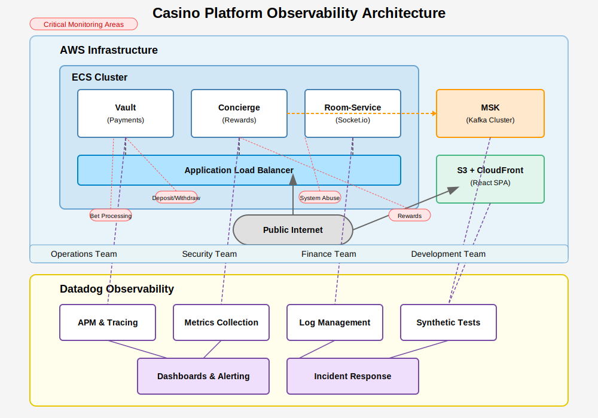

# Task description
Vault - responsible for our payments gateway, and keeps an internal database for user account balances, as well as transaction history, credit/debits for wins/losses, currencies exchange rates, etc.

Concierge - our rewards microservice, which tracks player volume, VIP points, and leaderboard points, as well as their tier/level and the amount of volume required to reach new levels. These reward events use an Amazon managed Kafka cluster (MSK).

Room-Service - responsible for socket.io updates on the client (e.g. deposits updating your balance, chat, level up notifications)

These microservices are deployed in AWS in an ECS cluster. They are behind a public application load balancer (ALB). The client is a React SPA, deployed to S3 with Cloudfront.

Given this brief description of the platform, design an observability, logging, and alerting strategy.

Some mission-critical areas include ensuring:
- Bets are being processed correctly
- Rewards are being calculated properly
- Users are not abusing the system (attempting to bet more than is allowed by the client, forcing rollbacks, etc.)
- Users are able to deposit and withdraw supported currencies
- Uptime monitoring for various services, e.g. "Customer chat is down"
- Feel free to add anything else you think would be helpful to monitor as a casino admin

You can use any tools you're most comfortable with; please come prepared to discuss your solutions. Architecture diagrams, code samples, or presentations are appreciated but not required.

# <span style="color: red;">*Solution proposal*</span>


## <span style="color: blue;">*Application design and clustering*</span>

Each of 3 services have external dependencies: database, Kafka queue, socket.io Containerised ( ECS, EKS ) must have proper healthchecks

### Table of Contents
- [1. Healthchecks](#1-Healthchecks)
- [2. Graceful shutdown](#2-Graceful-shutdown)
- [3. Structured logs](#3-Structured-logs)
- [4. DD integration](#4-DD-integration)




---

### 1. Healthchecks
<details>
<summary>Click to expand Healthchecks code</summary>

```javascript
# Code example

livenessProbe:
httpGet:
  path: /liveness
  port: 3000
initialDelaySeconds: 30
periodSeconds: 10
readinessProbe:
httpGet:
  path: /health
  port: 3000
initialDelaySeconds: 30
periodSeconds: 30
----------------------------------------  
const express = require('express');
const { Kafka } = require('kafkajs');
const mongoose = require('mongoose'); // Example for MongoDB
// const { Client } = require('pg'); // Uncomment for PostgreSQL

const app = express();
const PORT = process.env.PORT || 3000;

// Database settings - replace with your own
const DB_URI = process.env.DB_URI || 'mongodb://localhost:27017/myapp';

// Kafka settings - replace with your own
const KAFKA_BROKERS = (process.env.KAFKA_BROKERS || 'localhost:9092').split(',');
const KAFKA_CLIENT_ID = process.env.KAFKA_CLIENT_ID || 'health-check-client';

// Connect to database (MongoDB example)
mongoose.connect(DB_URI);
const db = mongoose.connection;

// Initialize Kafka client
const kafka = new Kafka({
clientId: KAFKA_CLIENT_ID,
brokers: KAFKA_BROKERS,
});
const producer = kafka.producer();

// Check database health
async function checkDatabaseHealth() {
try {
  // For MongoDB
  if (db.readyState === 1) {
    return { status: 'ok', message: 'Database connection is healthy' };
  } else {
    return { status: 'error', message: 'Database connection is not established' };
  }
  
  /* For PostgreSQL uncomment:
  const client = new Client();
  await client.connect();
  await client.query('SELECT 1');
  await client.end();
  return { status: 'ok', message: 'Database connection is healthy' };
  */
} catch (error) {
  return { 
    status: 'error', 
    message: `Database connection failed: ${error.message}` 
  };
}
}

// Check Kafka health
async function checkKafkaHealth() {
try {
  // Check connection by attempting to connect to the broker
  await producer.connect();
  await producer.disconnect();
  return { status: 'ok', message: 'Kafka connection is healthy' };
} catch (error) {
  return { 
    status: 'error', 
    message: `Kafka connection failed: ${error.message}` 
  };
}
}

// Endpoint for healthcheck
app.get('/health', async (req, res) => {
const results = {
  service: 'ok',
  timestamp: new Date().toISOString(),
  checks: {}
};

// Check database
results.checks.database = await checkDatabaseHealth();

// Check Kafka
results.checks.kafka = await checkKafkaHealth();

// Determine overall status
const hasErrors = Object.values(results.checks).some(check => check.status === 'error');

if (hasErrors) {
  results.service = 'error';
  res.status(500);
} else {
  res.status(200);
}

res.json(results);
});

// Simpler liveness probe endpoint
app.get('/liveness', (req, res) => {
res.status(200).send('OK');
});

// Start the server
app.listen(PORT, () => {
console.log(`Health check service listening on port ${PORT}`);
});

// Proper handling of termination signals
process.on('SIGTERM', () => {
console.log('SIGTERM signal received: closing HTTP server');
// Close connections before terminating
mongoose.disconnect();
producer.disconnect();
process.exit(0);
});
```

</details>

This section is about basic healthcheck for db and kafka check during start and work of app 
---

### 2. Graceful shutdown


<details>
<summary>Click to expand Graceful shutdown</summary>

```javascript
# Code example

livenessProbe:
httpGet:
  path: /liveness
  port: 3000
initialDelaySeconds: 30
periodSeconds: 10
readinessProbe:
httpGet:
  path: /health
  port: 3000
initialDelaySeconds: 30
periodSeconds: 30
----------------------------------------  
const express = require('express');
const { Kafka } = require('kafkajs');
const mongoose = require('mongoose'); // Example for MongoDB
// const { Client } = require('pg'); // Uncomment for PostgreSQL

const app = express();
const PORT = process.env.PORT || 3000;

// Database settings - replace with your own
const DB_URI = process.env.DB_URI || 'mongodb://localhost:27017/myapp';

// Kafka settings - replace with your own
const KAFKA_BROKERS = (process.env.KAFKA_BROKERS || 'localhost:9092').split(',');
const KAFKA_CLIENT_ID = process.env.KAFKA_CLIENT_ID || 'health-check-client';

// Connect to database (MongoDB example)
mongoose.connect(DB_URI);
const db = mongoose.connection;

// Initialize Kafka client
const kafka = new Kafka({
clientId: KAFKA_CLIENT_ID,
brokers: KAFKA_BROKERS,
});
const producer = kafka.producer();

// Check database health
async function checkDatabaseHealth() {
try {
  // For MongoDB
  if (db.readyState === 1) {
    return { status: 'ok', message: 'Database connection is healthy' };
  } else {
    return { status: 'error', message: 'Database connection is not established' };
  }
  
  /* For PostgreSQL uncomment:
  const client = new Client();
  await client.connect();
  await client.query('SELECT 1');
  await client.end();
  return { status: 'ok', message: 'Database connection is healthy' };
  */
} catch (error) {
  return { 
    status: 'error', 
    message: `Database connection failed: ${error.message}` 
  };
}
}

// Check Kafka health
async function checkKafkaHealth() {
try {
  // Check connection by attempting to connect to the broker
  await producer.connect();
  await producer.disconnect();
  return { status: 'ok', message: 'Kafka connection is healthy' };
} catch (error) {
  return { 
    status: 'error', 
    message: `Kafka connection failed: ${error.message}` 
  };
}
}

// Endpoint for healthcheck
app.get('/health', async (req, res) => {
const results = {
  service: 'ok',
  timestamp: new Date().toISOString(),
  checks: {}
};

// Check database
results.checks.database = await checkDatabaseHealth();

// Check Kafka
results.checks.kafka = await checkKafkaHealth();

// Determine overall status
const hasErrors = Object.values(results.checks).some(check => check.status === 'error');

if (hasErrors) {
  results.service = 'error';
  res.status(500);
} else {
  res.status(200);
}

res.json(results);
});

// Simpler liveness probe endpoint
app.get('/liveness', (req, res) => {
res.status(200).send('OK');
});

// Start the server
app.listen(PORT, () => {
console.log(`Health check service listening on port ${PORT}`);
});

// Proper handling of termination signals
process.on('SIGTERM', () => {
console.log('SIGTERM signal received: closing HTTP server');
// Close connections before terminating
mongoose.disconnect();
producer.disconnect();
process.exit(0);
});
```

</details>

- Stops accepting new connections
- Properly closes database connections
- Properly disconnects from Kafka
- Handles multiple termination signals (SIGTERM, SIGINT)
---

## <span style="color: blue;">*Logging*</span>

Let's talk about logging design pattern

## 3. Structured logs
<details>
<summary>Click to expand Structured logs</summary>

```javascript
# Code example

{
  "timestamp": "2025-03-20T08:12:34.567Z",
  "service": "vault",
  "level": "info",
  "trace_id": "abc123def456",
  "user_id": "user-789",
  "session_id": "sess-xyz",
  "request_id": "req-456",
  "message": "Processing bet request",
  "details": {
    "bet_amount": 50.00,
    "game_id": "blackjack-01",
    "currency": "USD"
  }
}
```

</details>

Critical Events to Log
Vault Service:

- Bet placement attempts (success/failure)
- Balance updates
- Currency exchanges
- Withdrawal/deposit requests and status changes
- Transaction rollbacks
- Account balance inconsistencies

Concierge Service:

- Reward calculations
- VIP level changes
- Leaderboard point updates
- Player volume updates
- Kafka message processing status

Room-Service:

- Socket connection/disconnection events
- Message delivery status
- Client notification delivery
- Chat message statistics
---


### 1. DD integration
<details>
<summary>Click to expand DD integration</summary>

```javascript
# Code example

// health.js - Health check module with Datadog integration
const express = require('express');
const router = express.Router();
const mongoose = require('mongoose');
const { Kafka } = require('kafkajs');
const { logger, tracer } = require('./datadog');

// Environment variables
const KAFKA_BROKERS = process.env.KAFKA_BROKERS ? process.env.KAFKA_BROKERS.split(',') : [];
const KAFKA_CLIENT_ID = process.env.KAFKA_CLIENT_ID || 'casino-service';
const KAFKA_HEALTH_TOPIC = process.env.KAFKA_HEALTH_TOPIC || 'healthcheck';
const DB_HEALTH_CHECK_TIMEOUT_MS = parseInt(process.env.DB_HEALTH_CHECK_TIMEOUT_MS || '2000', 10);
const KAFKA_HEALTH_CHECK_TIMEOUT_MS = parseInt(process.env.KAFKA_HEALTH_CHECK_TIMEOUT_MS || '5000', 10);

// Cache health check results
let dbHealthCache = { status: 'unknown', lastChecked: 0 };
let kafkaHealthCache = { status: 'unknown', lastChecked: 0 };
const CACHE_TTL_MS = 10000; // 10 seconds

/**
 * Database health check with Datadog tracing
 */
const checkDatabaseHealth = async () => {
  // Use cache if recent
  const now = Date.now();
  if (now - dbHealthCache.lastChecked < CACHE_TTL_MS) {
    return dbHealthCache.status === 'healthy';
  }

  let isHealthy = false;
  
  // Create a span for the database health check
  const span = tracer.startSpan('health.check.database');
  
  try {
    // Check MongoDB connection state
    if (mongoose.connection.readyState !== 1) {
      throw new Error('Database not connected');
    }

    span.setTag('db.connection_state', mongoose.connection.readyState);
    
    // Perform a simple query with timeout
    const startTime = Date.now();
    await Promise.race([
      mongoose.connection.db.admin().ping(),
      new Promise((_, reject) => 
        setTimeout(() => reject(new Error('Database ping timeout')), DB_HEALTH_CHECK_TIMEOUT_MS)
      )
    ]);
    
    const pingTime = Date.now() - startTime;
    span.setTag('db.ping_time_ms', pingTime);
    
    if (tracer.dogstatsd) {
      tracer.dogstatsd.histogram('casino.db.ping_time', pingTime);
      tracer.dogstatsd.increment('casino.health.db_check.success', 1);
    }
    
    isHealthy = true;
    logger.debug('Database health check passed', { pingTime });
  } catch (error) {
    span.setTag('error', true);
    span.setTag('error.message', error.message);
    span.setTag('error.type', error.name);
    
    if (tracer.dogstatsd) {
      tracer.dogstatsd.increment('casino.health.db_check.failure', 1, {
        error_type: error.name,
      });
    }
    
    logger.error('Database health check failed', { error: error.message });
    isHealthy = false;
  } finally {
    span.finish();
  }

  // Update cache
  dbHealthCache = {
    status: isHealthy ? 'healthy' : 'unhealthy',
    lastChecked: now
  };
  
  return isHealthy;
};

/**
 * Kafka health check with Datadog tracing
 */
const checkKafkaHealth = async () => {
  // Use cache if recent
  const now = Date.now();
  if (now - kafkaHealthCache.lastChecked < CACHE_TTL_MS) {
    return kafkaHealthCache.status === 'healthy';
  }

  let isHealthy = false;
  
  // Skip check if Kafka is not configured
  if (!KAFKA_BROKERS.length) {
    logger.warn('Kafka brokers not configured, skipping health check');
    return false;
  }

  // Create a span for the Kafka health check
  const span = tracer.startSpan('health.check.kafka');
  span.setTag('kafka.brokers', KAFKA_BROKERS.join(','));
  
  try {
    // Initialize Kafka client
    const kafka = new Kafka({
      clientId: KAFKA_CLIENT_ID,
      brokers: KAFKA_BROKERS,
    });

    // Create an admin client
    const admin = kafka.admin();
    
    // Connect with timeout
    const startTime = Date.now();
    await Promise.race([
      admin.connect(),
      new Promise((_, reject) => 
        setTimeout(() => reject(new Error('Kafka connection timeout')), KAFKA_HEALTH_CHECK_TIMEOUT_MS)
      )
    ]);

    // List topics to verify connection
    const topics = await admin.listTopics();
    span.setTag('kafka.topics_count', topics.length);
    
    // Disconnect after check
    await admin.disconnect();
    
    const connectTime = Date.now() - startTime;
    span.setTag('kafka.connect_time_ms', connectTime);
    
    if (tracer.dogstatsd) {
      tracer.dogstatsd.histogram('casino.kafka.connect_time', connectTime);
      tracer.dogstatsd.increment('casino.health.kafka_check.success', 1);
    }
    
    isHealthy = true;
    logger.debug('Kafka health check passed', { connectTime, topicsCount: topics.length });
  } catch (error) {
    span.setTag('error', true);
    span.setTag('error.message', error.message);
    span.setTag('error.type', error.name);
    
    if (tracer.dogstatsd) {
      tracer.dogstatsd.increment('casino.health.kafka_check.failure', 1, {
        error_type: error.name,
      });
    }
    
    logger.error('Kafka health check failed', { error: error.message });
    isHealthy = false;
  } finally {
    span.finish();
  }

  // Update cache
  kafkaHealthCache = {
    status: isHealthy ? 'healthy' : 'unhealthy',
    lastChecked: now
  };
  
  return isHealthy;
};

/**
 * Liveness endpoint - basic check if service is running
 */
router.get('/liveness', (req, res) => {
  const span = tracer.startSpan('health.liveness');
  try {
    if (tracer.dogstatsd) {
      tracer.dogstatsd.increment('casino.health.liveness.check', 1);
    }
    
    res.status(200).json({
      status: 'alive',
      timestamp: new Date().toISOString()
    });
  } finally {
    span.finish();
  }
});

/**
 * Readiness endpoint - checks if service can handle traffic
 */
router.get('/readiness', async (req, res) => {
  const span = tracer.startSpan('health.readiness');
  
  try {
    const dbHealth = await checkDatabaseHealth();
    const kafkaHealth = await checkKafkaHealth();
    
    // Service is ready if required dependencies are available
    const isReady = dbHealth; // DB is required, Kafka might be optional
    
    span.setTag('health.database', dbHealth);
    span.setTag('health.kafka', kafkaHealth);
    span.setTag('health.ready', isReady);
    
    const status = {
      status: isReady ? 'ready' : 'not_ready',
      timestamp: new Date().toISOString(),
      checks: {
        database: dbHealth ? 'healthy' : 'unhealthy',
        kafka: kafkaHealth ? 'healthy' : 'unhealthy'
      }
    };
    
    // Send service check to Datadog
    if (tracer.dogstatsd) {
      tracer.dogstatsd.serviceCheck(
        'casino.service.ready',
        isReady ? 0 : 2, // 0=OK, 1=WARNING, 2=CRITICAL
        {
          message: isReady ? 'Service is ready' : 'Service is not ready',
          tags: [`env:${process.env.NODE_ENV}`]
        }
      );
    }
    
    // Log status on failure
    if (!isReady) {
      logger.warn('Service not ready', status);
    }
    
    res.status(isReady ? 200 : 503).json(status);
  } catch (error) {
    span.setTag('error', true);
    span.setTag('error.message', error.message);
    
    logger.error('Readiness check failed', { error: error.message });
    
    res.status(500).json({
      status: 'error',
      message: 'Readiness check failed',
      timestamp: new Date().toISOString()
    });
  } finally {
    span.finish();
  }
});

/**
 * Detailed health check endpoint for internal monitoring
 */
router.get('/health', async (req, res) => {
  const span = tracer.startSpan('health.detailed');
  
  try {
    const dbHealth = await checkDatabaseHealth();
    const kafkaHealth = await checkKafkaHealth();
    
    // Service version from environment
    const version = process.env.SERVICE_VERSION || 'unknown';
    
    // Calculate overall health
    const isHealthy = dbHealth; // DB is critical
    
    span.setTag('health.database', dbHealth);
    span.setTag('health.kafka', kafkaHealth);
    span.setTag('health.overall', isHealthy);
    span.setTag('service.version', version);
    
    const memory = process.memoryUsage();
    span.setTag('memory.rss_mb', Math.round(memory.rss / 1024 / 1024));
    span.setTag('memory.heap_used_mb', Math.round(memory.heapUsed / 1024 / 1024));
    
    const healthStatus = {
      status: isHealthy ? 'healthy' : 'unhealthy',
      version,
      uptime: process.uptime(),
      timestamp: new Date().toISOString(),
      env: process.env.NODE_ENV,
      dependencies: {
        database: {
          status: dbHealth ? 'healthy' : 'unhealthy',
          connectionState: mongoose.connection.readyState,
          host: process.env.MONGODB_HOST || 'unknown',
        },
        kafka: {
          status: kafkaHealth ? 'healthy' : 'unhealthy',
          brokers: KAFKA_BROKERS.length ? KAFKA_BROKERS.join(',') : 'not_configured',
          clientId: KAFKA_CLIENT_ID
        }
      },
      memory: {
        rss: memory.rss,
        heapTotal: memory.heapTotal,
        heapUsed: memory.heapUsed
      }
    };
    
    // Send metrics to Datadog
    if (tracer.dogstatsd) {
      tracer.dogstatsd.gauge('casino.memory.rss', memory.rss);
      tracer.dogstatsd.gauge('casino.memory.heap_total', memory.heapTotal);
      tracer.dogstatsd.gauge('casino.memory.heap_used', memory.heapUsed);
      tracer.dogstatsd.gauge('casino.uptime', process.uptime());
    }
    
    logger.debug('Health check executed', { 
      healthy: isHealthy,
      dbHealthy: dbHealth,
      kafkaHealthy: kafkaHealth
    });
    
    res.status(isHealthy ? 200 : 503).json(healthStatus);
  } catch (error) {
    span.setTag('error', true);
    span.setTag('error.message', error.message);
    
    logger.error('Health check failed', { error: error.message });
    
    res.status(500).json({
      status: 'error',
      message: 'Health check failed',
      timestamp: new Date().toISOString()
    });
  } finally {
    span.finish();
  }
});

module.exports = router;
```

</details>

nodejs DD intergration  for metrics and logs 
---


## <span style="color: blue;">*Metrics*</span>


Metrics to Track:

Vault (Payments Gateway)
- Transaction throughput (deposits/withdrawals per minute)
- Transaction success/failure rates
- API latency for payment processing endpoints
- Database query performance
- Balance update operations

Concierge (Rewards)
- Reward calculation performance
- Kafka consumer lag
- VIP point/level processing times
- Leaderboard update frequency
- Player volume tracking accuracy

Room-Service (Socket.io)
- WebSocket connection count
- Message delivery rates and latency
- Connection error rates
- Notification delivery success rate


## <span style="color: blue;">*Alerts*</span>


Vault (Payments Gateway)
- High transaction failure rate (>2% in 5min window)
- Unusual balance change velocity (potential fraud)
- Unexpected currency exchange rate fluctuations
- Database connection issues or high query latency

Concierge (Rewards)
- Kafka consumer lag exceeding thresholds
- Failed reward calculations
- Abnormal patterns in point accumulation (potential abuse)
- Leaderboard calculation delays

Room-Service (Socket.io)
- High socket disconnection rate
- Message delivery failure spike
- Abnormal connection patterns (potential DoS)

ECS
- Container CPU/memory utilization
- Container restart frequency
- ECS service health and task counts
- Container startup/shutdown times
- Cluster node amount ( depends of Fargate of on-prem )

ALB
- Request count, latency, error rates
- Connection count and time
- Rejected connection rate
- 4xx/5xx error rates per service

MSK (Kafka)
- Broker health and disk usage
- Topic lag metrics
- Partition count and replication status
- Network throughput

Some mission-critical areas include ensuring:

- Bets are being processed correctly
- Rewards are being calculated properly

  <details>
    <summary>Click to expand Calculate points based on event type and amount</summary>

    ```javascript

    // Calculate points based on event type and amount
      const expectedPoints = this.calculateExpectedPoints(event);
      
      // Process the actual reward
      const result = await this.processReward(event);
      
      // Calculate processing time
      const hrtime = process.hrtime(startTime);
      const processingTimeMs = hrtime[0] * 1000 + hrtime[1] / 1000000;
      
      // Validate points calculation matches expected
      if (Math.abs(result.pointsAwarded - expectedPoints) > 0.01) {
        logger.warn('Rewards calculation discrepancy', {
          correlationId,
          userId: event.userId,
          expectedPoints,
          actualPoints: result.pointsAwarded,
          difference: result.pointsAwarded - expectedPoints,
          event: event,
          action: 'reward.discrepancy'
        });
        
        dogstatsd.increment('rewards.discrepancies', 1, [`user:${event.userId}`]);
      }
      
      // Check if user leveled up
      if (result.newLevel && result.newLevel > result.previousLevel) {
        logger.info('User level up', {
          correlationId,
          userId: event.userId,
          previousLevel: result.previousLevel,
          newLevel: result.newLevel,
          totalPoints: result.totalPoints,
          action: 'reward.levelup'
        });
        
        dogstatsd.increment('rewards.levelups', 1, [`user:${event.userId}`, `new_level:${result.newLevel}`]);
      }
    ```
  </details>

  <details>
  <summary>Click to expand Validate bet amount against user balance before processing</summary>

  ```javascript
    const userBalance = getUserBalance(userId);
    if (userBalance < betAmount) {
      logger.warn('Bet rejected: Insufficient funds', {
        correlationId,
        userId,
        betAmount,
        actualBalance: userBalance,
        action: 'bet.rejected'
      });
      return { success: false, reason: 'INSUFFICIENT_FUNDS' };
    }

    try {
      // Record start time for processing duration
      const startTime = process.hrtime();
      
      // Process the bet
      const result = processBetGameLogic(userId, betAmount, betType, gameId);
      
      // Calculate processing time
      const hrtime = process.hrtime(startTime);
      const processingTimeMs = hrtime[0] * 1000 + hrtime[1] / 1000000;
  ```
  </details>

- Users are able to deposit and withdraw supported currencies
- Uptime monitoring for various services, e.g. "Customer chat is down"
- Users are not abusing the system (attempting to bet more than is allowed by the client, forcing rollbacks, etc.)
